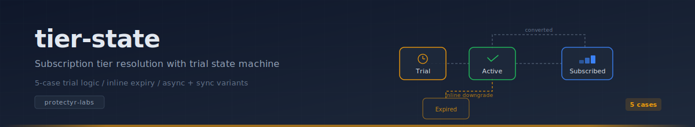
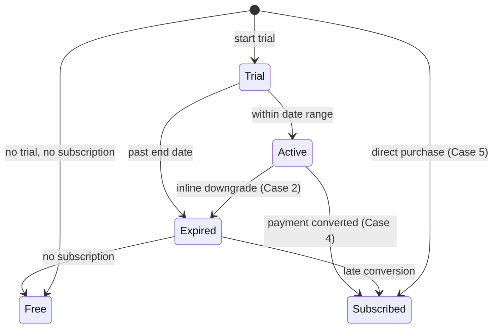

<p align="center">
  
</p>

<p align="center">
  <a href="https://github.com/protectyr-labs/tier-state/actions/workflows/ci.yml"></a>
  <a href="https://www.npmjs.com/package/@protectyr-labs/tier-state"></a>
  <a href="LICENSE"></a>
  <a href="https://www.typescriptlang.org/"></a>
  
</p>

Resolve a user's effective subscription tier from trial + payment state. Handles 5 exhaustive cases including stale trials that cron jobs missed, with both async (server, with side effects) and sync (client, pure) variants.

## Quick start

```bash
npm install @protectyr-labs/tier-state
```

```typescript
import { getEffectiveTier, TierConfig, TierUser } from '@protectyr-labs/tier-state';

const config: TierConfig = { tiers: ['free', 'starter', 'pro'], defaultTier: 'free' };

const user: TierUser = {
  id: 'u-001',
  trialStatus: 'active',
  trialStartDate: '2025-06-01T00:00:00Z',
  trialEndDate: '2025-07-01T00:00:00Z',
  trialTier: 'pro',
  subscriptionTier: null,
};

const result = await getEffectiveTier(user, config);
// => { tier: 'pro', source: 'trial', trialStatus: 'active' }
```

## State diagram



## The 5 cases

| Case | Condition | Effective tier | Source |
|------|-----------|---------------|--------|
| 1 | Active trial, within date range | `trialTier` | `trial` |
| 2 | Active trial, past end date (stale) | `defaultTier` | `downgraded` |
| 3 | Trial already expired | `defaultTier` | `default` |
| 4 | Trial converted to subscription | `subscriptionTier` | `subscription` |
| 5 | Never trialed | `subscriptionTier` or `defaultTier` | `subscription` or `default` |

Case 2 is the non-obvious one: the trial flag says "active" but the date says "expired." The async variant auto-downgrades via your handler so users never keep Pro access after their trial window closes, even if the cron job is late.

## API

| Function | Purpose |
|----------|---------|
| `getEffectiveTier(user, config, handler?, now?)` | Async -- resolves tier, triggers downgrade handler for Case 2 |
| `getEffectiveTierSync(user, config, now?)` | Sync -- same logic, no side effects |
| `normalizeTier(tier, config)` | Map legacy tier names via `config.legacyMapping` |
| `isTierAtLeast(userTier, requiredTier, config)` | Feature gating -- is this tier at or above required? |

### Downgrade handler

```typescript
const handler: DowngradeHandler = {
  async markExpired(userId) { /* UPDATE users SET trial_status = 'expired' */ },
  async recordEvent(userId, event, properties) { /* analytics.track(...) */ },
};
```

## Use cases

**SaaS trial management** -- User starts a 14-day trial. On day 15, if the cron job has not run yet, the inline downgrade catches it so they do not keep Pro access.

**Feature gating** -- Before showing a Pro feature, check the user's effective tier. The sync variant works client-side without async overhead.

**Subscription analytics** -- Track how many users are in each state (trialing, expired, converted, free) to understand conversion funnel health.

## Design decisions

**Inline downgrade over cron-only expiry.** Cron jobs fail silently, serverless cold starts delay scheduled functions, and queue backlogs during traffic spikes delay event processing. The inline check at read time is a defense-in-depth safety net. When the cron eventually runs, it finds the user already expired and becomes a no-op.

**Async + sync split.** Server-side code can and should persist the stale-trial downgrade as a side effect. Client-side code (React, Vue) cannot write to the database and needs a pure synchronous function for UI rendering. Shipping both variants avoids forcing callers to choose between correctness and compatibility.

**Configurable tier ordering over hardcoded names.** Tier names change. The `TierConfig.tiers` array defines ordering once; all comparisons use index positions. Adding a tier between starter and pro is a one-line config change. The `legacyMapping` handles renames without data migrations.

**Zero dependencies.** The library uses only `Date` from the standard library. All persistence is externalized through the `DowngradeHandler` interface.

## Limitations

- No database included -- caller manages persistence and passes user state in
- No webhook/notification -- downgrade handler is a local callback, not a push notification
- Single-user resolution -- call once per user, no batch API

## Origin

Built for [OTP2](https://github.com/protectyr-labs), a multi-tenant cybersecurity SaaS platform where trial-to-subscription transitions are a core billing concern. Extracted into a standalone module when the same 5-case pattern appeared in three separate services.

> [!NOTE]
> This module handles tier *resolution* only. For the full subscription lifecycle including payment webhooks and Stripe integration, see the OTP2 billing service.

## See also

- [funnel-state](https://github.com/protectyr-labs/funnel-state) -- validated customer lifecycle state machine
- [casl-consent](https://github.com/protectyr-labs/casl-consent) -- CASL-compliant email consent tracking

## License

MIT
